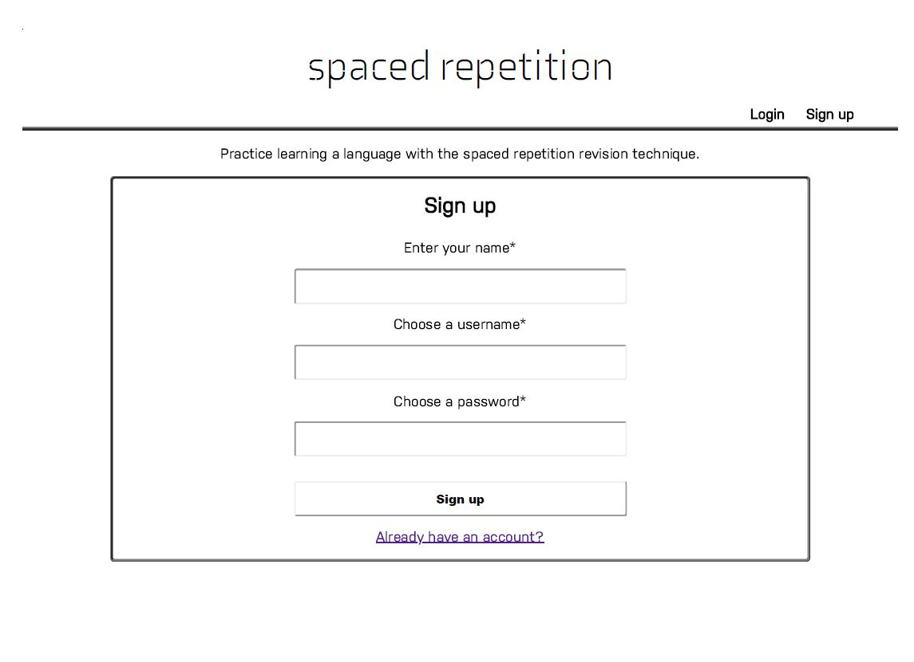
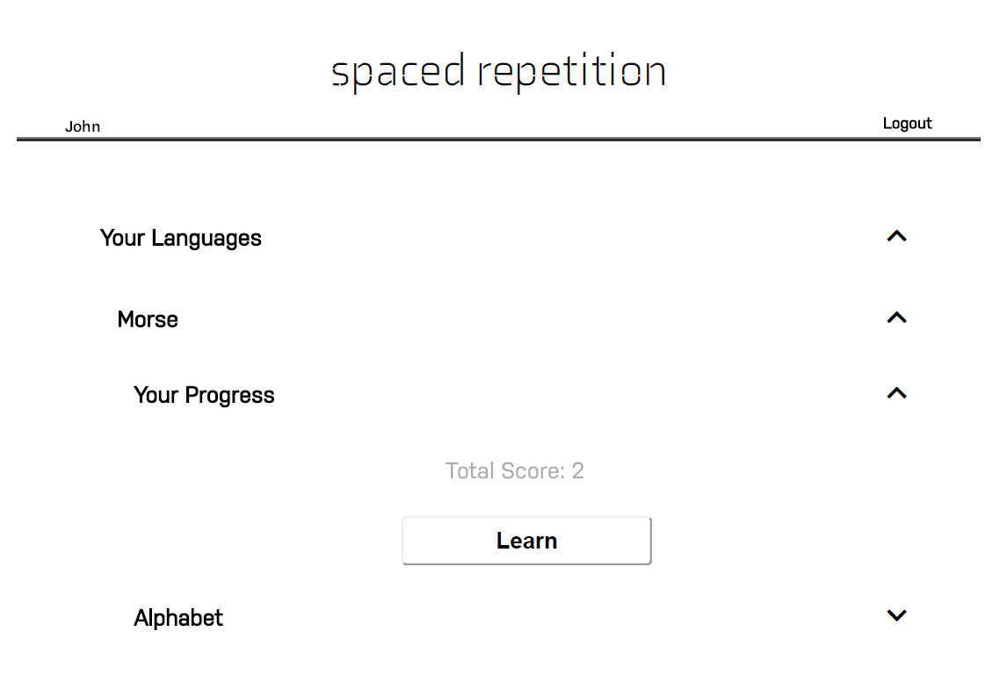
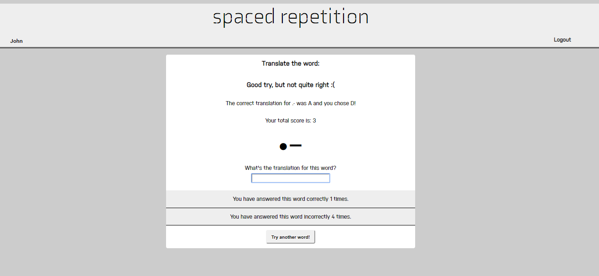

## Spaced repetition capstone
This app allows uers to practice learning a language through the spaced repetition revision technique. Users can create an account and have access to a library of characters on the home dashboard.  Users can then practice by being shown a character and submit a guess.  They will then receive feedback with the total score and the correct and incorrect count for that character. The next wcharacters in sequence are determiend by the spaced repetition algorithm.
np
The currently available language option in this app is morse corde.

## Links
* Live Application: https://spaced-rep-ivory.now.sh/
* API Endpoint: https://vast-meadow-24481.herokuapp.com/api/
* Client repo: https://github.com/mntri4/spaced-rep
* Server repo: https://github.com/mntri4/spaced-rep-api

### Team: 
- Mario Martinez

## Project Description:

This is the backend API server for Thinkful's Spaced Repetition project.

The app aims to simulate flash card drills more effectively by automating the [Spaced Repetition](https://en.wikipedia.org/wiki/Spaced_repetition)   learning technique.  The app tracks the users performance history for each word, revisiting words which have proven to be more challenging for the use with a higher frequency.  The app utilizes user authorization, automatic log out on inactivity, data persistence, and score keeping.  

NOTE:  A data structure constraint was placed upon the team.  This constrained forbid the use of data structures other than [Linked Lists](https://en.wikipedia.org/wiki/Linked_list) for data mutation and management.


 ## Endpoints:
|  Endpoint   | Function |
|		--			  |		--	 	|
| GET /api/language | Assuming a valid JWT, returns status 200 along with the entirety of the 'language' and 'words' tables for the currently logged in user. |
| GET /api/language/head |  Assuming a valid JWT, returns status 200 along with the next word to be asked along with it's translation, correct and incorrect guess count for the associated word, as well as the user's total score.  |
|POST /api/language/guess | When 'guess' is submitted in the request body along with a valid JWT, returns status 200 along with both the untranslated and translated version of the submitted word, a boolean value for the submitted value's correctness, as well as an updated versions for the correct and incorrect guess count and the user's total score. |
| POST /api/auth/token  | When the submitted username and password validated returns a JWT that will expire in 20 minutes.  |
| PUT /api/auth/token | When submitted with a currently valid JWT, along with 'name', 'username', and 'user_id' in the request body, will return a fresh JWT. |
| POST /api/user  | When submitted with valid 'name', 'username', and 'password' fields in the request body, will return status 201 and the newly created 'user_id'.|


## User stories: 
The currently available language option in this app is morse corde.

### Registration page
As a prospective user, I can register an account so that I can login and use the application.

As a first time user:
- I'm directed to a registration page.
- On that page, I can enter my name, username, and password.
- If all of my information is correct, upon clicking the submit button, I'm taken to the login page.
- If any of my information is incorrect, I'm given an appropriate error message and the option to correct my information.


### Login page:
As a registered user, I can login to the application so that I can begin learning.

On any visit when I'm not logged in:
- I can navigate to the "login" page.

As a registered user on the login page:
- I can navigate back to the registration page.
- I can enter my username and password.
- If my submitted username and password are incorrect, I'm given an appropriate error message so that I can attempt to login again.
- If my submitted username and password are correct, the app "logs me in" and redirects me to my dashboard.

As a logged in user:
- The app displays my name and presents a logout button.
- The application refreshes my auth token so that I can remain logged in while active on the page.

As a logged in user who is starting a new session:
- The application remembers that I'm logged in and doesn't redirect me to the registration page.

### Dashboard page
As a logged in user, I'm directed to a dashboard where I can see my progress learning my language.

When viewing the dashboard as a logged in user:
 - The app gets my language and words progress from the server
- I'm shown my language
- I'm shown the words to learn for the language
- I'm shown my count for correct and incorrect responses for each word
- I'm given a button/link to start learning
- I'm shown the total score for guessing words correctly

### Learning page - 1
As a logged in user, I can learn words using spaced repetition.

When viewing the learning page as a logged in user:
 - The app gets my next word to learn details from the server
- I'm shown the word to learn
- I'm shown my current total score
- I'm shown the number of correct and incorrect guesses for that word
- I'm presented an input to type my answer/guess for the current words translation

### Learning page - 2
As a logged in user, I can see feedback on my submitted answers.

After submitting an answer on the learning page as a logged in user:
 - The app POSTs my answer for this word to the server
- The server will update my appropriate scores in the database
- After submitting, I get feedback whether I was correct or not
- After submitting, I'm told the correct answer
- My total score is updated
- I'm told how many times I was correct and incorrect for the word
- I can see a button to try another word


### Learning page - 3
As a logged in user, I can learn another word after receiving feedback from my previous answer.

When viewing feedback for an answer on the learning page as a logged in user:
 - I'm presented with a button that I can click to learn another word
- When clicking on the button I see the next word to learn


##

## Spin up:

1.) Clone repository:
```bash
    git clone https://github.com/mntri4/spaced-rep-api
   ```
###
2.)  Terminal magic:

If using user `admin`:

```bash
mv example.env .env
createdb -U admin morse
createdb -U admin morse-test
```

If your `admin` user has a password be sure to set it in `.env` for all appropriate fields. Or if using a different user, update appropriately.
```bash

npm install

npm run migrate

env MIGRATION_DATABASE_NAME=morse-test npm run migrate

```

3.) Start the server:
```bash
    npm start
    OR
    npm run dev
```


## Scripts:


Start the application:
```bash
npm start
```

Start nodemon for the application: 
```bash
npm run dev
```

Run the tests mode:
```bash
npm test
```

Run the migrations up: 
```bash
npm run migrate
```

Run the migrations down:
```bash
npm run migrate -- 0
```

## Front-end Stack
## Tech Stack
React
HTML5
CSS3

## Back-end Stack:

#### Host 
- Heroku
#### Tech
- Node.js
- Pg
- Knex
- Express
- Helmet
- Cors
- Morgan
- Jsonwebtoken
- Bcrypt.js
- Dotenv
- Nodemon (dev)
- Mocha (dev)
- Chai (dev)
- Supertest (dev)
- Postgrator-cli (dev)

## Screenshots
Login Screen/Landing Page:



Progress Screen:


Learn Characters:



Error Screen:


